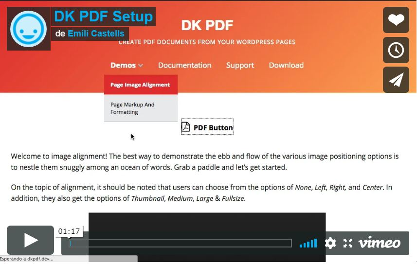

# Description
DK PDF allows site visitors convert posts and pages to PDF using a button.

### Features
* Add PDF button in posts (including custom post types) and pages.
* Configure PDF header and footer, add custom logo, custom CSS and more.
* Copy plugin templates in your theme for PDF customizations.
* Multiple shortcodes: [dkpdf-button], [dkpdf-pagebreak], [dkpdf-remove], and more..
* Add custom fonts to the PDF.

### Addons
* Do you need to create a PDF with a selection of your articles? [DK PDF Generator](https://codecanyon.net/item/dk-pdf-generator/13530581) is the perfect tool for you.
