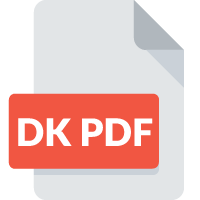

<!-- _coverpage.md -->

# DK PDF <small>1.9.7</small>
> DK PDF is a plugin for WordPress that allows site visitors convert posts and pages to PDF using a button.

[WordPress.org](https://wordpress.org/plugins/dk-pdf/)
[GitHub](https://yordansoares.github.io/dk-pdf)
[Getting Started](/#description)