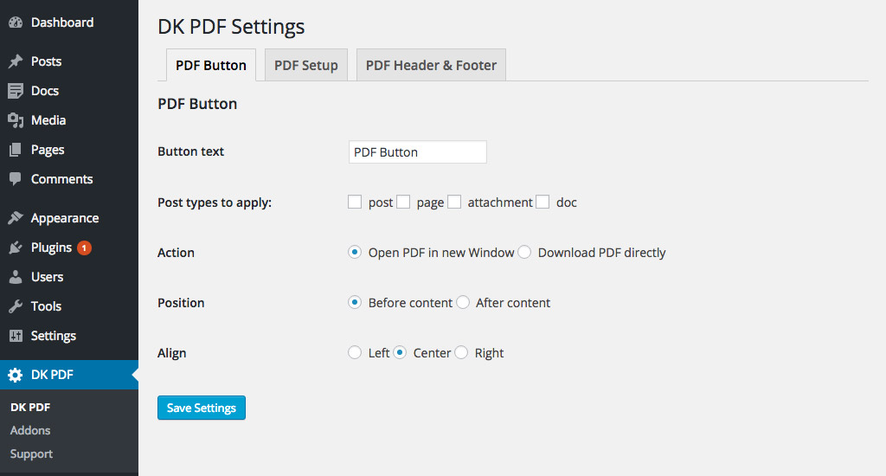

# Button Settings

<small><em>Button Settings</em></small>

### Button text
Text in the button, also can be modified in plugin dkpdf-button template, see [How to use DK PDF templates in your Theme]() for more info.

### Post types to apply
Select post types to show pdf button.

* post
* page
* attachment
* custom post types

### Action
What to do when pdf button is clicked.
* Open PDF in new Window
* Download PDF directly

### Position
Where button appears.
* Before content
* After content

### Align
Text align property of the button.
* Left
* Center
* Right
