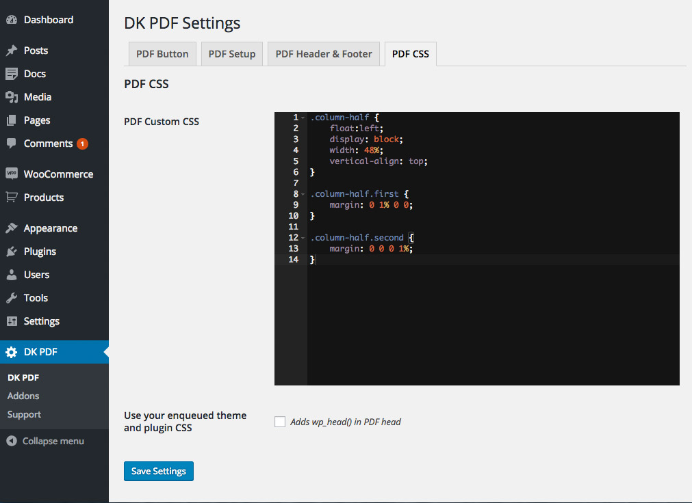

# CSS Settings

<small><em>CSS Settings</em></small>

### PDF Custom CSS
Allow adding custom CSS to the PDF.

### Use your enqueued theme and plugin CSS
This option adds `wp_head()` to PDF `<head>`.