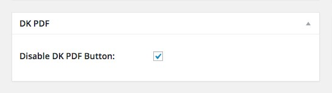

# Disable DK PDF Button in single post types

<small><em>Disable DK PDF Button in single post types</em></small>

When activating a post type (post, page…) in `DK PDF Settings / PDF Button` the button is going to show in all posts of the selected post type, if you like to disable the PDF button in any particular post you have a metabox where you can check to not show it.