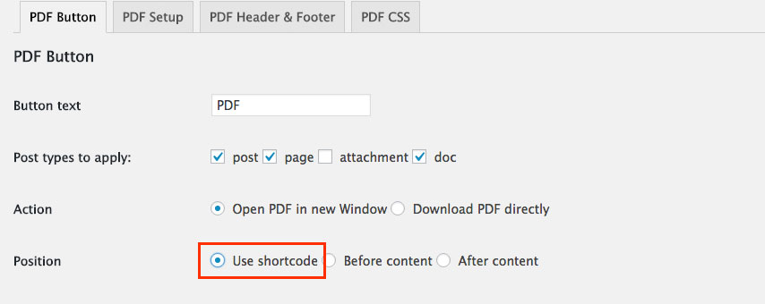

# [dkpdf-button]

You can add `dkpdf-button` shortcode to any post, page or custom post type.

Use Position / Use shortcode when you’re adding the shortcode button manually either in the content of the post or in a PHP template.



<p style="margin-top:-1em"><small><em>Use shortcods</em></small></p>

To add the shortcode in a PHP template, use:

```
<?php echo do_shortcode('[dkpdf-button]'); ?>
```