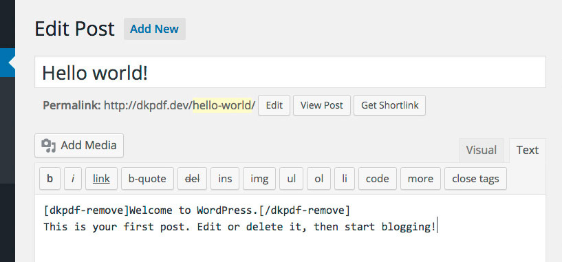
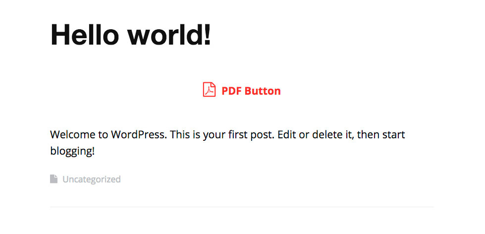
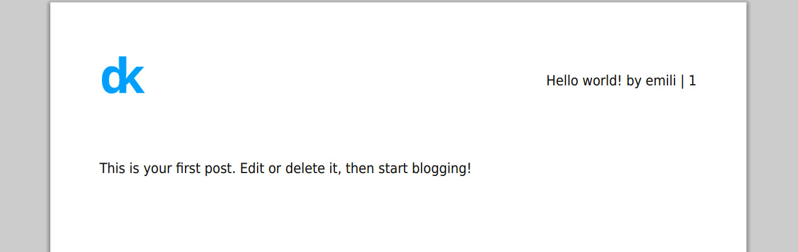

# [dkpdf-remove]
Use this shortcode to remove pieces of content in the generated PDF.

New shortcode `tag` attribute `Since: 1.9`

```
[dkpdf-remove tag="gallery"]
[gallery ids="827,811,770"]
[/dkpdf-remove]
```


<p style="margin-top:-1em"><small><em>WP Gallery</em></small></p>

In this example, clicking PDF Button, gallery shortcode isn’t shown in the generated PDF.

[](_media/dkpdf-remove.pdf)
<p style="margin-top:-1em"><small><em>Download PDF</em></small></p>


<p style="margin-top:-1em"><small><em>Using Adding dkpdf-remove shortcode</em></small></p>


<p style="margin-top:-1em"><small><em>The piece of content inside the shortcode remains visible in the page</em></small></p>


<p style="margin-top:-1em"><small><em>Using [dkpdf-pagebreak] results</em></small></p>