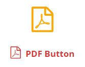

# FontAwesome icons support

In order to see FontAwesome icons in the PDF you’ve to use a code, see [FontAwesome Cheatsheet](https://fontawesome.com/cheatsheet/) page.

[](_media/font-awesome-icons-support.pdf)
<p style="margin-top:-1em"><small><em>Click to download a demo PDF</em></small></p>

```
<i style="font-size:50px;color:orange;" class="fa">&#xf1c1;</i>
```

Important: Since version 1.9.6, you must create a new font folder and upload a .ttf or .woff file of Fontawesome and add it in with filters, [more info here.](https://web.archive.org/web/20191016221531/http://wp.dinamiko.com/demos/dkpdf/doc/how-to-add-custom-fonts/)