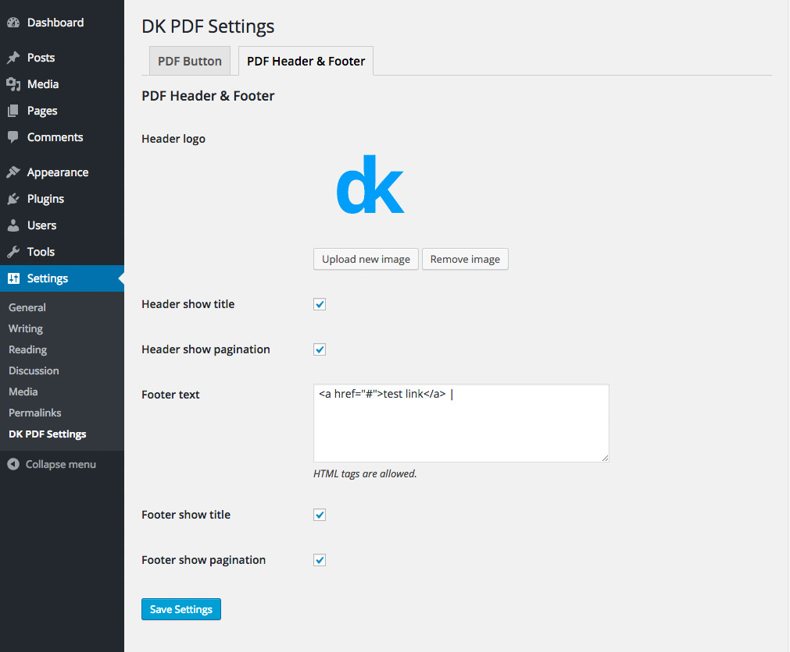

# Header & Footer Settings

<small><em>Header & Footer Settings</em></small>

### Header logo
Upload any image you like here, for example a logo.

### Header show title
Displays page title in the header.

### Header show pagination
Displays pagination in the header.

### Footer text
Displays raw text or HTML markup in the footer.

### Footer show title
Displays page title in the footer.

### Footer show pagination
Displays pagination in the footer.