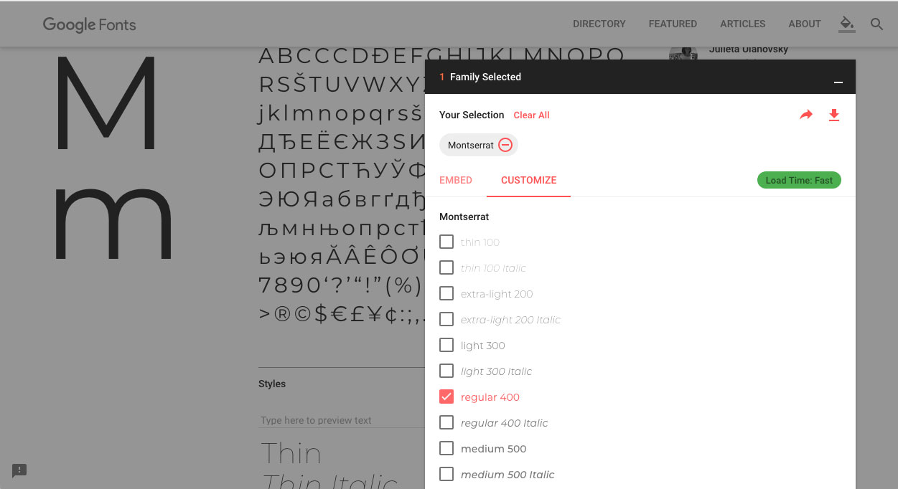
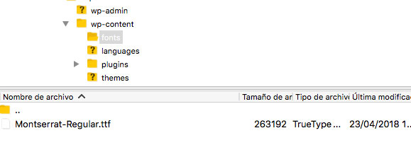
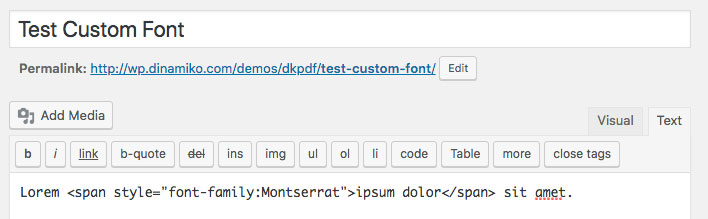

# How to add custom fonts

Since version 1.9.6, DK PDF allows you to add custom fonts to the PDF easily using `dkpdf_mpdf_font_dir` and `dkpdf_mpdf_font_data` filters.

In this example we are going to use Montserrat Google Font, so the first thing to do is [download the font from here](https://fonts.google.com/specimen/Montserrat).


<p style="margin-top:-1em"><small><em>Monserrat Google Font</em></small></p>

In your WordPress installation, create a new `folder` fonts inside `wp-content` and upload `Montserrat-Regular.ttf` file:


<p style="margin-top:-1em"><small><em>Adding a font</em></small></p>

Next thing to do is add the filters, you can add this code to your theme `functions.php` for example:

```
<?php
/**
 *  Define the directory with the font via fontDir configuration key.
 */
add_filter( 'dkpdf_mpdf_font_dir', function ( $font_dir ) {
	// path to wp-content directory
	$wp_content_dir = trailingslashit( WP_CONTENT_DIR );
	array_push( $font_dir, $wp_content_dir . 'fonts' );
	return $font_dir;
});
/**
 * Define the font details in fontdata configuration variable
 */
add_filter( 'dkpdf_mpdf_font_data', function( $font_data ) {
	$font_data['montserrat'] = [
		'R' => 'Montserrat-Regular.ttf',
	];
	return $font_data;
});
```

Finally, create a new post and add this content:

```
Lorem <span style="font-family: Montserrat;">ipsum dolor</span> sit amet.
```


<p style="margin-top:-1em"><small><em>Adding a custom font style</em></small></p>

For the sake of simplicity, we are adding the css style inline directly in the post content, just keep in mind that you can add the styles in DK PDF Settings CSS tab.

That's all, you should now see Montserrat font displayed in the PDF like so:


<p style="margin-top:-1em"><small><em>Font display PDF</em></small></p>

Here you'll find more information about how to add fonts in mPDF which is the library that DK PDF uses to generate the PDF: [Fonts in mPDF v7+](https://mpdf.github.io/fonts-languages/fonts-in-mpdf-7-x.html)