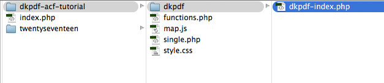
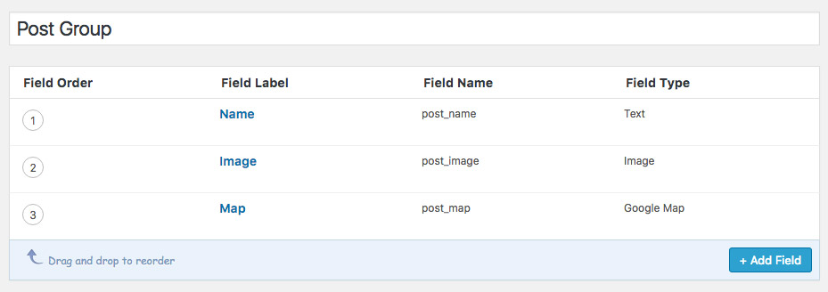
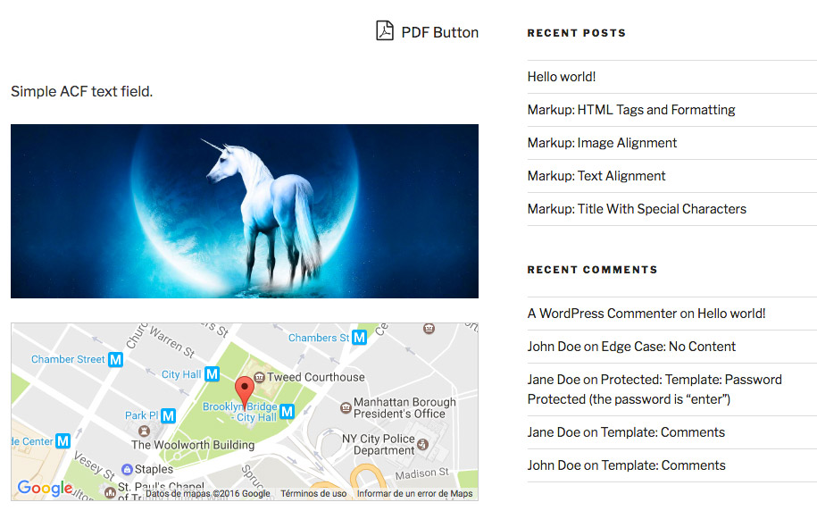
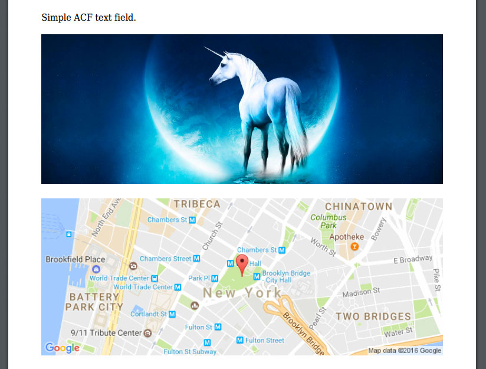

# Tutorial PDF Advanced Custom Fields

In this tutorial we are going to add Advanced Custom Fields to PDF using DK PDF. We’ll add Text, Image and Google Maps ACF fields to the PDF.

For this tutorial I’ve created a child theme based on Twenty Seventeen and I uploaded it to [GitHub](https://github.com/Dinamiko/dkpdf-acf-tutorial).

### Steps
1. Add dkpdf-index.php template to your Theme (or Child theme)
2. Display ACF fields in the PDF

### 1. Add dkpdf-index.php template to your Theme
Create a new folder `dkpdf` in the root of your Theme (or Child theme).
Inside `dkpdf` folder create a new php file and save it as `dkpdf-index.php`.
Copy template code from here: [`dkpdf-index.php`](https://gist.github.com/Dinamiko/8bf97a3962f140ef34752477116ae4f4) and paste it inside of your `dkpdf-index.php`.


<p style="margin-top:-1em"><small><em>ACF Theme</em></small></p>

### 2. Display ACF fields in the PDF


<p style="margin-top:-1em"><small><em>Advanced Custom Fields Post Group</em></small></p>

After creating and displaying ACF fields in [`single.php`](https://github.com/Dinamiko/dkpdf-acf-tutorial/blob/master/single.php) template, this is how our post looks like.


<p style="margin-top:-1em"><small><em>Single post with ACF custom fields</em></small></p>

At this point, if you click PDF Button nothing is going to be printed in the PDF because by default `dkpdf-index.php` template only outputs [`the_content`](https://developer.wordpress.org/reference/functions/the_content/). In order to display ACF fields in the PDF you have to copy ACF code from single.php and paste it to `dkpdf-index.php`.

Open `single.php` and copy the code responsible of displaying the fields:

```
<?php
if( get_field('post_name') ) { ?>
	<p><?php echo get_field('post_name');?></p>
<?php }
$image = get_field('post_image');
if( !empty($image) ): ?>
	" alt="<?php echo $image['alt']; ?>" />
<?php endif; ?>

<?php
$location = get_field('post_map');
if( !empty($location) ): ?>
	<div class="acf-map">
		<div class="marker" data-lat="<?php echo $location['lat']; ?>" data-lng="<?php echo $location['lng']; ?>"></div>
	</div>
<?php endif; ?>
```

Open `dkpdf-index.php` and paste it in this block of code:

```
<?php
  // add your stuff here
  the_content();
?>
```


```
<?php
$location = get_field('post_map');
if( !empty($location) ): ?>
  ,<?php echo $location['lng'];?>&zoom=15&size=1500x250&sensor=false&markers=color:red%7Clabel:%7C<?php echo $location['lat'];?>,<?php echo $location['lng'];?>">        
<?php endif; ?>
```

Now if you click PDF button you’ll see all ACF fields printed in the PDF:


<p style="margin-top:-1em"><small><em>PDF with ACF Text, Image and Google Maps fields.</em></small></p>

That’s all, I hope that you’ve enjoyed the tutorial 🙂