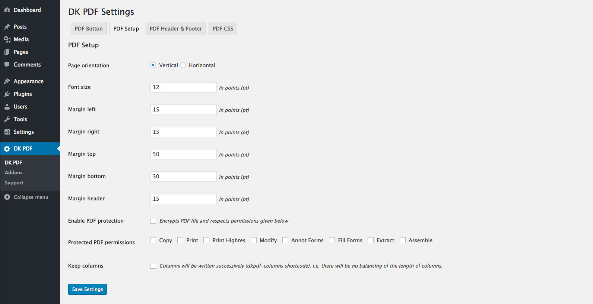

# PDF Setup Settings

<small><em>PDF Setup Settings</em></small>

### Page orientation
Selects the format of the PDF: Horizontal or Vertical.

### Font size
Sets PDF font size, in points (pt).

### PDF Margins
Sets PDF margins, in points (pt).

### Enable PDF protection `Since: 1.9.1`
Encrypts and sets the PDF document permissions.

### Keep columns `Since: 1.9.1`
Used in dkpdf-columns shortcode. Columns will be written successively, there will be no balancing of the length of columns.