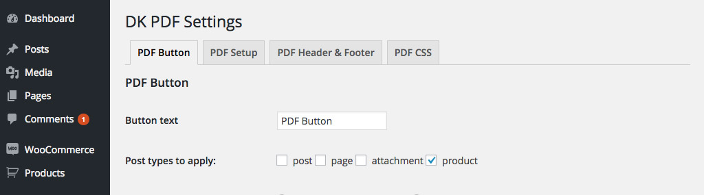
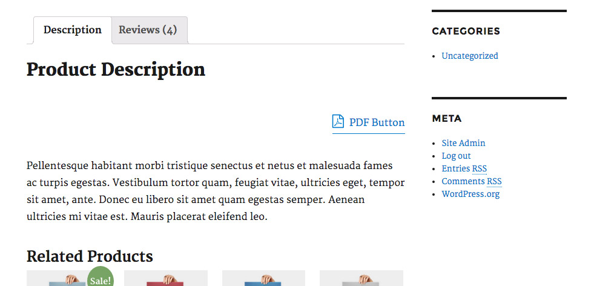
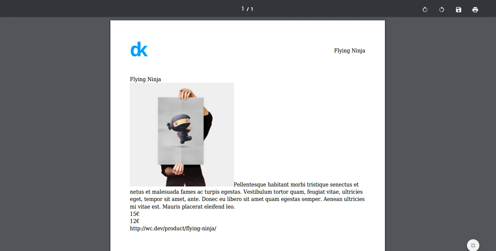
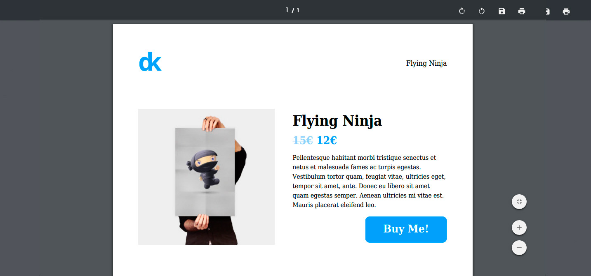

# Tutorial PDF WooCommerce

We're going to create a PDF for WooCommerce products using DK PDF. We'll create a PDF that shows the following WooCommerce information: Title, Featured image, Description, Price and a Link to product.

## See WooCommerce Product PDF finished

### Ingredients
* WordPress installation with WooCommerce and DK PDF.
* Code editor, I'm using Sublime Text in this tutorial.

### Steps
1. Copy plugin templates in Theme (or Child theme).
2. Get WooCommerce product information.
3. Create PDF HTML layout.

### 1. Copy plugin templates in Theme
DK PDF implements a template system that allows overriding plugin templates in an upgrade safe way, I'm using this system in all my latest plugins, [DPortfolio](https://wordpress.org/plugins/dportfolio/) and [Docu](https://wordpress.org/plugins/docu/) are using the same template system.

### 2. Get WooCommerce product information
Check product post type in Settings / PDF Button / Post types to apply.


<p style="margin-top:-1em"><small><em>Checking PDF button for product post type</em></small></p>


<p style="margin-top:-1em"><small><em>DK PDF button before product description text</em></small></p>

The first thing to do is get the information from WordPress database, open dkpdf-index.php template in your favourite code editor and replace body content.

```
 <body>
	    <?php
		    global $post;
		    $pdf = get_query_var( 'pdf' );
		    $post_type = get_post_type( $pdf );
		    if( $pdf ) {
			    // get info
			    $title = get_the_title();
			    if( has_post_thumbnail( $post->ID ) ) {
			    	$thumbnail = get_the_post_thumbnail( $post->ID, 'medium' );
			    }			    
			    $description = get_the_excerpt();
			    $product = new WC_Product( $post->ID );
			    $currency = get_woocommerce_currency_symbol();
			    $regular_price = get_post_meta( $post->ID, '_regular_price');
			    $sale_price = get_post_meta( $post->ID, '_sale_price');	
			    $link = get_the_permalink();
		   
			    // print info
			    echo esc_attr( $title ).'<br>';			   
			    if( $thumbnail ) { echo $thumbnail; }
			    echo esc_html( $description ).'<br>';
			    echo esc_attr( $regular_price[0] ). $currency .'<br>';
			    if( $sale_price ) { 
				echo esc_attr( $sale_price[0] ). $currency .'<br>';
			    }
			    echo esc_url( $link ).'<br>';
		    }
	    ?>
    </body>
```

Notice that we're escaping data ([esc_attr](https://developer.wordpress.org/reference/functions/esc_attr/), [esc_url](https://developer.wordpress.org/reference/functions/esc_attr/)… ) before being printed in the PDF. This is a security best practice for preventing printing undesired data (like JavaScript injections) coming from WordPress database.


<p style="margin-top:-1em"><small><em>Getting and printing WooCommerce product information in the PDF</em></small></p>

### 3. Create PDF HTML layout
This is the Layout we’ll try to replicate in the PDF.


<p style="margin-top:-1em"><small><em>DK PDF WooCommerce layout for single product</em></small></p>

For the sake of simplicity, We’re not going to cover adding custom fonts to the PDF, this will come in a next tutorial 🙂

Final code for body:

```
    <body>
	    <?php
		    global $post;
		    $pdf = get_query_var( 'pdf' );
		    $post_type = get_post_type( $pdf );
		    if( $pdf && $post_type == 'product'  ) {
			    $title = get_the_title();
			    if( has_post_thumbnail( $post->ID ) ) {
			    	$thumbnail = get_the_post_thumbnail( $post->ID, 'medium' );
			    }			    
			    $description = get_the_excerpt();
			    $product = new WC_Product( $post->ID );
			    $currency = get_woocommerce_currency_symbol();
			    $regular_price = get_post_meta( $post->ID, '_regular_price');
			    $sale_price = get_post_meta( $post->ID, '_sale_price');	
			    $link = get_the_permalink(); ?>

			    <div class="product-container">
			    	<div class="product-left">
			    		<?php  if( $thumbnail ) { echo $thumbnail; } ?>
			    	</div>
			    	<div class="product-right">
			    		<h1><?php echo esc_attr( $title );?></h1>
			    		<?php
			    			if( $sale_price[0] != '' ) { ?>
			    				<h2>
			    					<span class="price line-through"><?php echo esc_attr( $regular_price[0] ). $currency; ?></span>
			    					<span class="price"><?php echo esc_attr( $sale_price[0] ). $currency; ?></span>
			    				</h2>
			    			<?php } else { ?>
			    				<h2><span class="price"><?php echo esc_attr( $regular_price[0] ). $currency; ?></span></h2>
			    			<?php }			    			
			    		?>
			    		<p><?php echo esc_html( $description );?></p>
			    		<div class="button-container">
			    			<div class="button-item">
			    				<a style="font-weight:bold;text-decoration:none;color:#FFF;" href="<?php echo esc_url( $link );?>">Buy Me!</a>
			    			</div>			    			
			    		</div>
			    	</div>	
			    </div>
		    <?php }
	    ?>
    </body>
```
Replace default CSS style:

```
	<style type="text/css">
      		body {
      			background:#FFF;
      			font-size: 100%;
      		}
      		.product-container {
      			width:100%;
      			float:left;
      		}
		.product-container h1 {padding-top:15px;}
		.product-container p {font-size:14px;}
      		.product-left {
      			width:50%;
      			float:left;
      		}
      		.product-right {
      			width:50%;
      			float:right;
      			margin:0;
      			padding:0;
      			line-height: 130%;     			
      		}
      		.price {
      			float:left; 
      			margin-right:30px;
      			padding:0;
      			line-height: 130%; 
      			color:#029ff7;  
      		}
      		.line-through {
      			text-decoration: line-through;
      			color:#a3d2fb;
      		}
      		.button-container {
      			width:100%;
      			float:left;
      		}
      		.button-item {
      			float:right;
      			width:150px;
      			height:28px;
      			border-radius: 10px;
      			background:#029ff7;
      			font-size:24px;
      			text-align: center;
      			margin:0;
      			line-height:100%;
      			padding: 15px;
      		}
		<?php 
			// get pdf custom css option
			$css = get_option( 'dkpdf_pdf_custom_css', '' );
			echo $css; 
		?>			
	</style>
```


<p style="margin-top:-1em"><small><em>DK PDF WooCommerce Customization tutorial</em></small></p>

We’re done 🙂 I hope you enjoyed this tutorial, feel free to visit the demo and leave a comment here if you have any doubt.